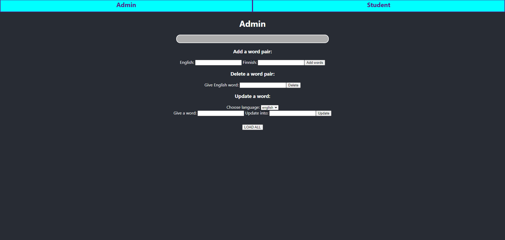
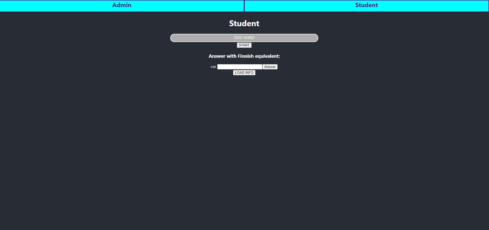

# Fullstack-project

Project work for the TAMK Course 4A00EZ62-3003

This application lets the user to test their language skills
with a simple word quiz format. The application includes an interface
for administration purposes (modifying the quiz content stored in the database)
and the 'student' interface for testing their skills with the quiz.

### Background

This project is part of the Backend Development Course
in the University of Applied Sciences of Tampere. The reasoning
behind the creation of this application is to make sure that the student
knows the basics of both frontend and backend development, including database
handling, requests with external modules to the database, possible error handling and
related messages and creation of reasonable user experience.

The current development plan is to develope and update this project
until 14 of January 2022. Any further development is unsure.

### Screenshots

### Frameworks and modules

The project is developed with the following:

- Node.js

- React (for frontend)

- modules including: express, mysql, cors, json-schema, react-router (for frontend)

### Features

Admin:

- Can add, delete and update word pairs in a simple language database.
- Can view current data via browser's consol.

Student:

- Load and answer a short word quiz based on the words in the database.
- View results after quiz is complete.
- Retry the current quiz.

### Installation

Heroku app no longer functions, previously hosted at:
https://fullstack-honkanen.herokuapp.com/

NOTE!!!
Current testing requires env file for data base access!!!

Test environment can be established by cloning the repo (requires git installation):

- Go to a folder location you want to place the git repo project files with a command line tool
- Use following: git clone https://github.com/jonijhonkanen/Fullstack-project.git
- Repo files should now be downloading
- Go to Fullstack-project - folder (code editor recommended, Visual Studio Code used for this example)
- Install modules with npm install
- Add env file with correct key-value pairs (not included in repo)
- Run the app with command: node index.js (Listening on port 8080 or similar should appear on console)
- Open in your browser with url: localhost:8080 (or with different port number if given)
- You should now be able to view the Admin view of the app in your browser

Note! Loading might take few seconds.

### Link to Screencast (in Finnish)

https://youtu.be/Ra5GvH9zNA0
